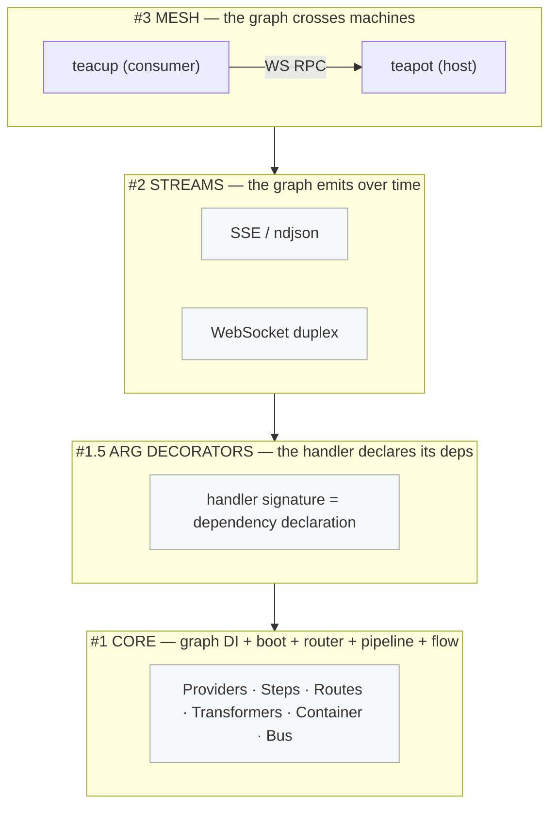
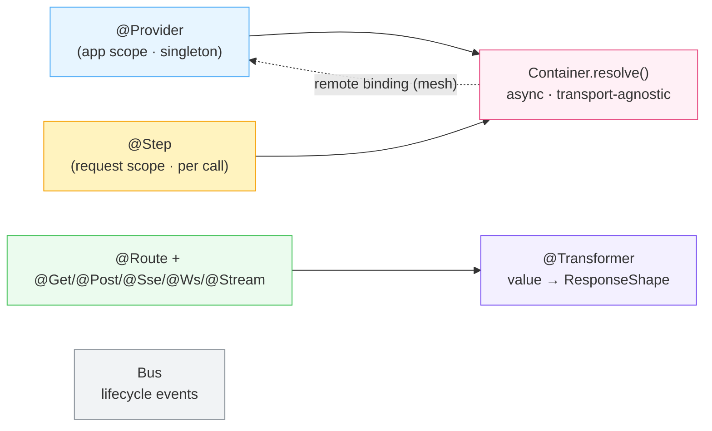
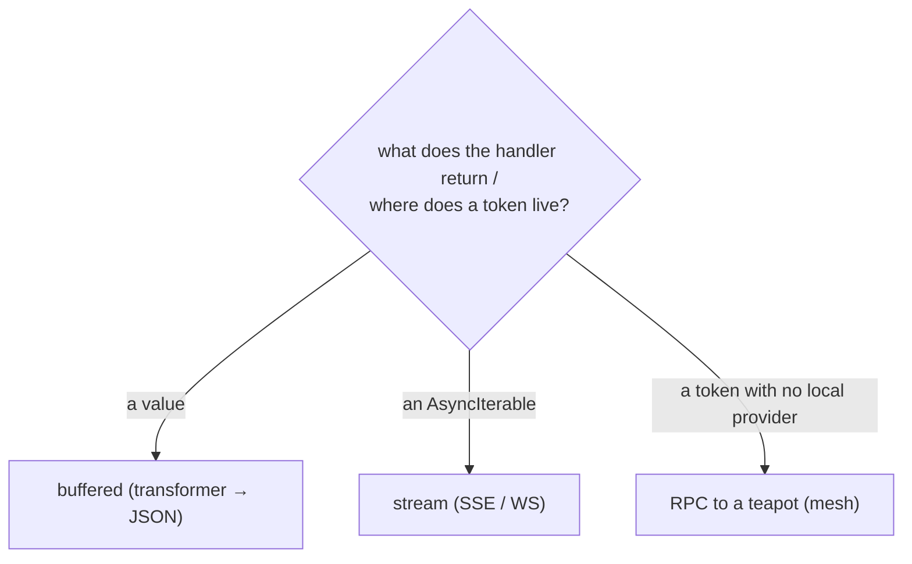
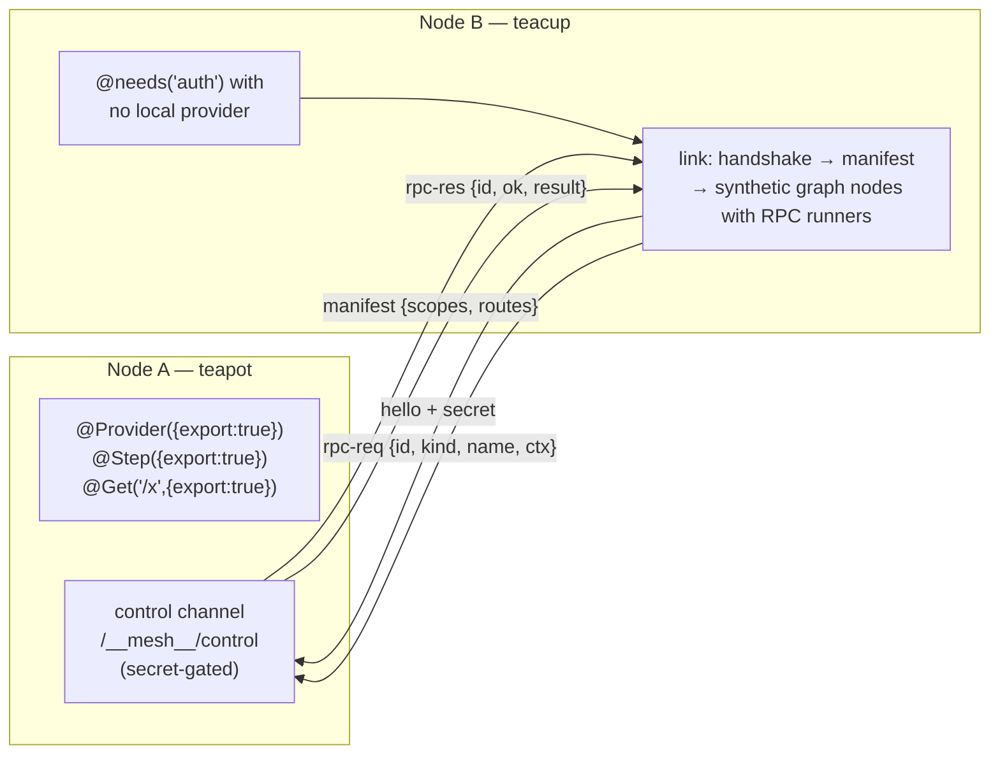

# green-tea — Architecture

> The request and boot are an explicit **dependency graph**, not a mutable middleware chain.
> You declare *what* you need; the framework computes the order. The graph can extend in
> **time** (streams) and across **machines** (mesh).

## The four layers



## Building blocks



## Request lifecycle

```mermaid
sequenceDiagram
    participant C as Client
    participant H as http.ts (transport)
    participant P as Pipeline
    participant G as Graph (providers/steps)
    participant T as Transformer

    C->>H: HTTP request
    H->>H: matchRoute(method, path)
    H->>P: runPipeline(seed = req envelope)
    P->>G: providers (cached) + steps (topo order)
    Note over G: each step merges into ctx;<br/>throw = short-circuit, return = continue
    P->>P: handler(args resolved from ctx)
    alt returns a value
        P->>T: transformer → {status, headers, body}
        T-->>C: buffered response
    else returns an AsyncIterable
        P-->>C: stream (SSE / ndjson / WS), backpressure + cleanup
    else @needs a remote token
        G-->>C: RPC to teapot, value spliced into ctx
    end
```

## The unifying rule



One question — *"what produces this token and where does it live?"* — answers local DI,
streaming, and distribution. That single seam is why green-tea isn't "Express with decorators":
**the graph is the product.**

## Mesh walking skeleton (spec #3)



- **Provider exported → app scope** (resolved once via RPC, cached).
- **Step exported → request scope** (RPC per request, carries the request envelope).
- **Route exported → proxy** (teacup forwards the request, teapot runs the full pipeline).

Deferred to mesh sub-specs: discovery/auto-registration, 2-way load-balancing, failover/health.
